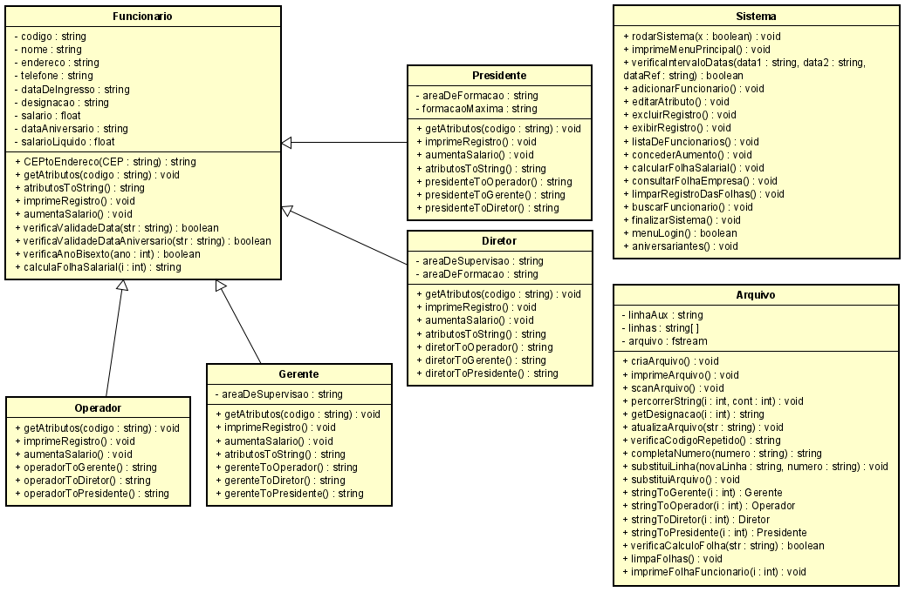

# Sistema de Gerenciamento de Folha de Pagamento
Projeto de Linguagem de Programação 1 2021.2 professor Marcelo Iury

Projeto da Disciplina Linguagem de Programação I.
A ideia aqui é criar um aplicativo de console chamado Sistema de Gerenciamento de Folha de
Pagamento. Além disso, este projeto deve muitas classes e subclasses. Ele também vem com
muitos recursos interessantes e interessantes.

Requisitos:

- Adicionar um novo funcionário: As informações tratadas neste recurso são o número do código
do funcionário, nome, endereço, telefone, data de ingresso (dia, mês e ano), designação (Na
empresa, há quatro tipos de funcionários: operador, gerente, diretor e presidente) e salário.
Tipos específicos de funcionários, possuem informações adicionais que precisam ser
recuperadas:

  - Gerente: nome da área de supervisão
  
  - Diretor: nome da área de supervisão e área de formação
  
  - Presidente: área de formação e qual formação acadêmica máxima (por exemplo,
  especialista, mestre, doutor...)
  
- Modificar ou editar um registro de funcionário: Os usuários podem editar o número de código
do funcionário, data de ingresso (dia, mês e ano), nome, endereço, telefone, designação e
salário.

- Excluir um registro de funcionário: O registro de um funcionário pode ser excluído usando o
código do funcionário. Uma mensagem de confirmação de exclusão mostra se o usuário
realmente deseja excluir o registro do arquivo. Caso o funcionário seja um presidente ou
diretor, ele não poderá ser removido.

- Exibir registro de funcionário: Ao inserir o número de código do funcionário, os usuários
podem acessar todas as informações fornecidas relacionadas a um determinado funcionário
por meio desta função.

- Exibir lista de Funcionários: Este recurso exibe o registro de todos os funcionários

- Exibir lista de Funcionários por tipo: Este recurso exibe o registro de todos os funcionários de
um determinado tipo.

- Conceder aumento para os funcionários: este recurso ao ser solicitado deverá rodar uma rotina
de aumento de salário para todos os funcionários. Sendo os percentuais de aumento:

  - Operador: 5%

  - Gerente: 10%

  - Diretor: 20%

  - Presidente 30%

- Calcular Folha Salarial: Responsável por realizar o cálculo de salário de todos os funcionários
para um determinado mês. Assim, será solicitado do usuário o mês a que se refere a folha
salarial. Caso a folha para este mês já tenha sido calculada, exibir mensagem alertando que a
folha para o seguinte mês já foi calculada. Deverá ser executada uma rotina que irá gerar
aleatoriamente, mas apenas uma única vez, as informações como o número de dias
trabalhados no mês pelo funcionário e o número de horas extras trabalhadas. Usar regra que a
hora-extra equivale ao dobro daquilo pago para hora normal. Deverá também ser contabilizado
os descontos relativos ao imposto de renda e previdência social.

- Imprimir uma Folha de Salário do Funcionário: Esse recurso também solicita o código do
funcionário ou nome completo. Deve constar o salário base, descontos e salário líquido do
empregado.

- Imprimir a folha salarial empresa: Esse recuso dá opção de o usuário escolher ou a folha anual
calculando o somatório de salário de cada empregado ou uma folha mensal, sendo que para
esta última será solicitado qual mês do ano.

- Buscar: recurso que permite a busca de funcionários pelo:

  - Nome: fazer busca parcial

  - Data de ingresso (dia, mês e ano): fazer por intervalo de tempo

  - Endereço: fazer busca parcial

- As informações de registro de funcionário exibidas são aquelas fornecidas ao adicionar um
novo registro de funcionário.

- Todos os dados devem ser salvos em arquivo. Criar funções para salvamento e recuperação dos
dados em arquivo.

- É esperado uma interface de usuário. Pode ser uma interface gráfica do usuário (GUI) ou
console de texto.

Primeira parte do projeto:

- Entrega do documento de projeto com diagramas de classes (UML) das entidades de dados e
projeto das telas. É esperado várias classes, herança, polimorfismo e classes abstratas, todas
estas relações devem ser descritas no documento.

- Segunda parte do projeto:

  - Código fonte + apresentação do projeto;

  - Satisfazer todos os requisitos gerais listados acima.

  - Comentários de documentação adequados no código.

  - Pelo menos um recurso interessante não listado acima.

Os projetos devem ser desenvolvidos em grupos de até 3 alunos

# Diagrama de classes

 
  

